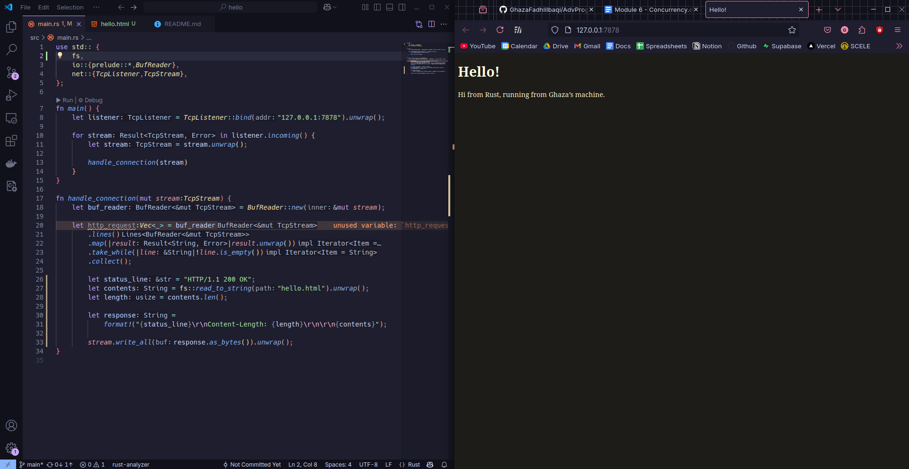

# Advanced Programming Module 6
### Muhammad Ghaza Fadhlilbaqi - 2306173321
## Commit 1 Reflection
In the `main.rs` file, we first imported the necessary modules, such as `net::{TcpListener,TcpStream},` for networking features and `io::{prelude::*,BufReader},` for input and output handling.

Then for the `main` function, we first create a `TcpListener` and bind it to the intended address (in our case: `127.0.0.1` on on port `7878`), using `unwrap()` to handle potential binding errors. 
We then use a for loop to iterate through incoming connection attempts, where each successful connection produces a TcpStream. For each stream, we call `unwrap()` to extract the stream from its Result wrapper and pass it to our `handle_connection` function.

Finally, the `handle_connection` function, we first create a `BufReader` from our stream parameter to efficiently read data line by line. We then parse the HTTP request by collecting lines into a vector, using map to unwrap each line and take_while to stop at the first empty line (which separates HTTP headers from the body). Finally, we print the complete request to the console for inspection using the debug format.

## Commit 2 Reflection

After modifying some code in `main.rs`, specifically the `handle_connection` function, my webserver can serve a `html file` instead of just returning plain text to the terminal.

In the updated function, the code will still create a `BufReader` and parse the HTTP request as before. However, I've added important new functionality that allows the server to respond to clients. First, the server will create a status line with `"HTTP/1.1 200 OK"` to indicate a successful response. Then, it will read the contents of a file named `hello.html` using `fs::read_to_string()` and calculate its length.

My server will then combine these elements to create a properly formatted HTTP response using the `format!` macro, which includes the status line, a Content-Length header, and the HTML content separated by the required carriage returns and newlines. Finally, the server sends this response to the client by calling `write_all()` on the stream, converting the string to bytes first.

## Commit 3 Reflection

Again, after refactoring bits of code in `main.rs`, now everytime our http status code is 404 (NOT FOUND), the server will now return the `404.html` page as an error display.

In the updated function, the status_line variable will go through an if check, if the request line is `"GET / HTTP/1.1"`, it serves the `hello.html` page with a 200 OK status. 

Otherwise, it serves the `404.html` page with a 404 Not Found status. The function reads the appropriate HTML file, determines its length, and constructs the HTTP response. Finally, the response is sent to the client.

## Commit 4 Reflection
Another update to our good friend `main.rs`, this time we added some code to simulate a slow request.
When a request is made to `"127.0.0.1/sleep"`, the thread sleeps for 10 seconds, mimicking a delay. The code now also uses a `match` statement to determine the status_line and filename based on the request line. 
If the request is `"GET / HTTP/1.1"`, it serves `hello.html` with a 200 OK status. 
If the request is `"GET /sleep HTTP/1.1"`, it also serves `hello.html` with a 200 OK status after a **10-second delay**. 
Otherwise, it serves `404.html` with a 404 Not Found status. 
Since my server is single-threaded, it causes the server to become **unresponsive** to other requests during the 10 second sleep period.
